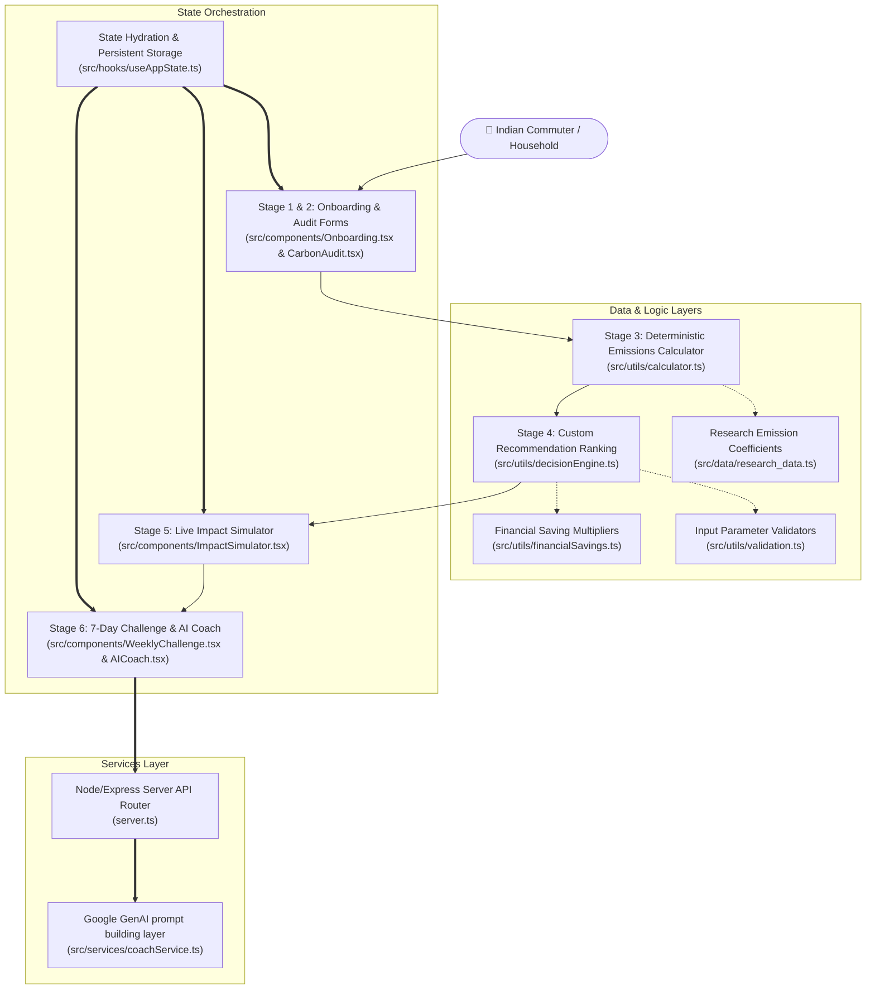

# CarbonCoach AI — Project Architecture

This document describes the high-level system architecture and code organization of the CarbonCoach AI platform built for PromptWars.

## Modular Component Structure

The project strictly isolates UI concerns from business calculations, static preset databases, state management, and external AI interfaces:

---

## Code Directory Mapping

### 1. Components (`src/components/`)
* **`Onboarding.tsx`**: Renders the 3 main persona selection buttons (Student Commuter, Working Professional, Family Household).
* **`CarbonAudit.tsx`**: Renders the questionnaire inputs (transport, km, electricity bills, AC usage, food habits, shopping frequency, flights).
* **`CarbonProfileView.tsx`**: Renders the carbon scorecard (10–99), the annual emission totals, and the comparison charts with Paris Accord targets.
* **`DecisionEngineView.tsx`**: Renders the prioritized action list sorted by impact × ease, complete with interactive "Profile Explainability Links" explaining the rationale behind each recommendation.
* **`ImpactSimulator.tsx`**: Renders interactive sliders and toggles where users simulate lifestyle commitments to dynamically calculate Rupee (₹) and CO₂ savings.
* **`WeeklyChallenge.tsx`**: Tracks the 7-Day sustainability challenge checkmarks and streak values.
* **`AICoach.tsx`**: Orchestrates the chat window, rendering conversation logs processed via DOMPurify and ReactMarkdown.
* **`ErrorBoundary.tsx`**: Captures runtime Javascript exceptions to prevent app crashes.

### 2. Services Layer (`src/services/`)
* **`coachService.ts`**: Builds structured instructions (Context, Ranked Actions, Progress Streak) and targets the Gemini `gemini-3.5-flash` endpoint using official SDK parameters.

### 3. Business Logic & Utilities (`src/utils/`)
* **`calculator.ts`**: The mathematical core executing the carbon calculations based on verified coefficients.
* **`decisionEngine.ts`**: Adjusts global saving potentials according to user lifestyles, maps ease weights, and returns sorted priority suggestions.
* **`financialSavings.ts`**: The single source of truth for converting carbon metrics (kg CO₂) into Indian Rupees (₹) across categories (energy, travel, shopping, flights).
* **`validation.ts`**: Strongly-typed type guards verifying input boundaries (ranges, options, types) before persistence or API calls.
* **`ui/formatters.ts`**: Color, icon, and text display templates for UI scoring and cards.

### 4. Application State (`src/hooks/`)
* **`useAppState.ts`**: Coordinates page navigation, audit inputs, profile results, and synchronizes saved properties to local storage.

### 5. Constants & Datasets (`src/constants/` & `src/data/`)
* **`src/data/research_data.ts`**: Indian grid factors (0.82kg CO₂/kWh), transportation weights, and diet multipliers.
* **`src/constants/benchmarks.ts`**: Constants for USA, Global, and India averages.
* **`src/constants/storage.ts`**: Storage keys mapping active pages and onboarding details.
* **`src/constants/appState.ts`**: Header guidance messages for navigation screens.
